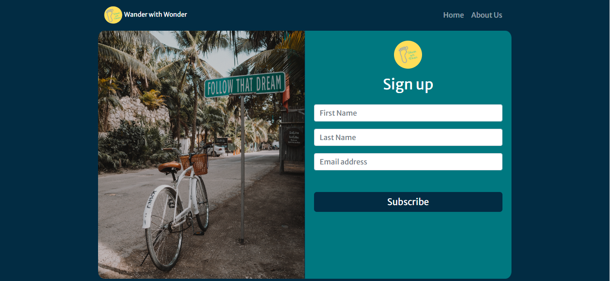
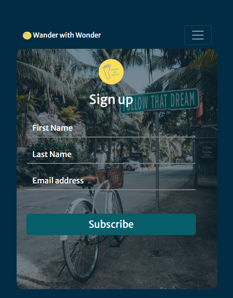
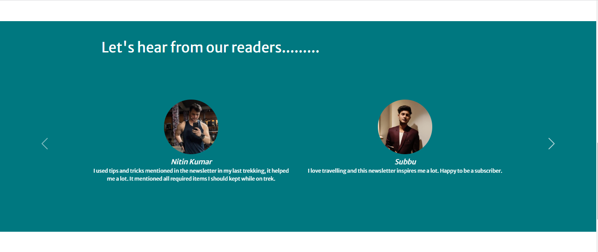

# Wander with wonder

```Wander with Wonder``` is a Newsletter Signup page where users can subscribe to receive weekly/monthly newsletter related to travel, food, travel guide, exciting destination, iteniery and so on. This app uses the ```mailchimp``` services. <br>

Click to open [Wander with Wonder](https://boiling-falls-53657.herokuapp.com/)


<br>

<br>

<br>

### Structure

1. ```app.js``` is the starting point for the website, configures the server and content. 


### Environment variable

1. ```API_KEY``` Api key provided by mailchimp 
2. ```SERVER```  Server provided by mailchimp
3. ```LIST_ID``` List Id provided by mailchimp

## Getting Started

### Installation

1. To install all dependencies in the package.json
   ```npm install```

2. To run the application
   ```npm start```

3. Open http://localhost:3000/ check and confirm
